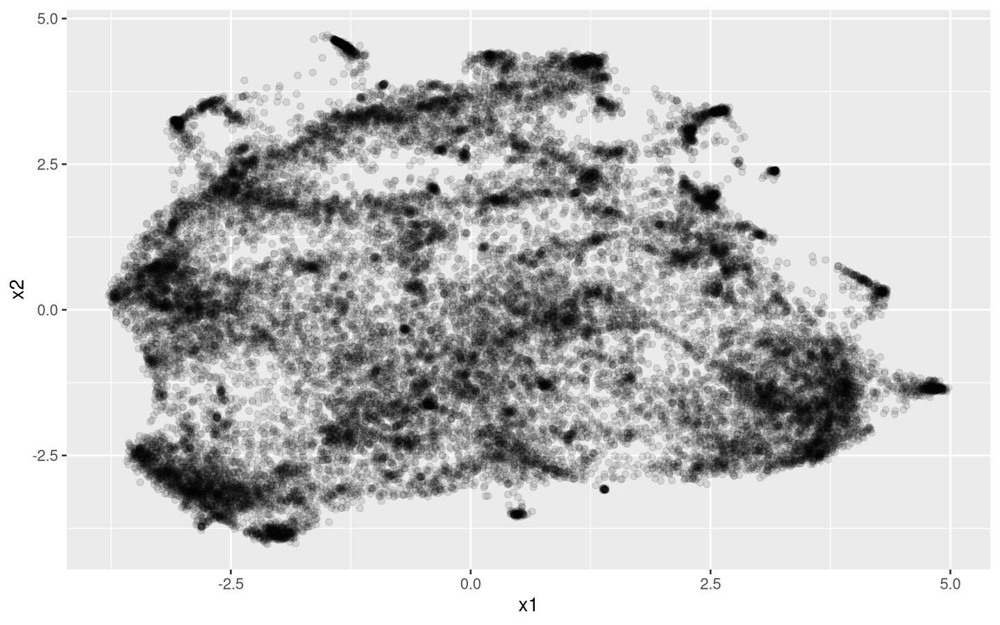
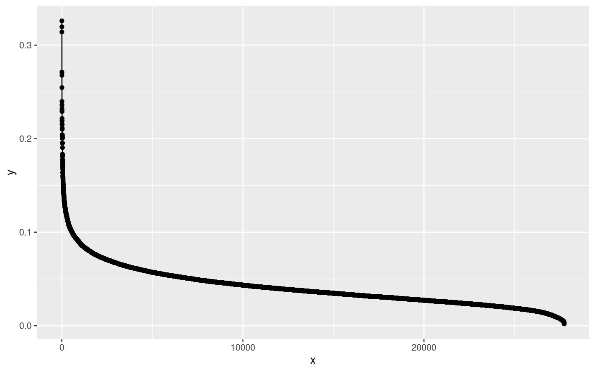
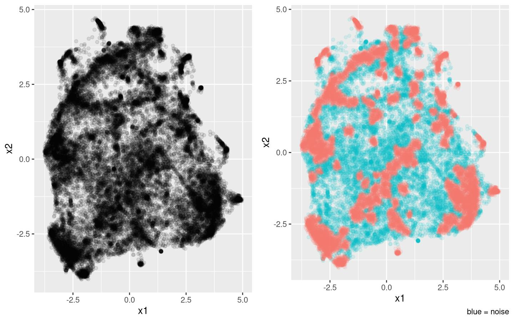
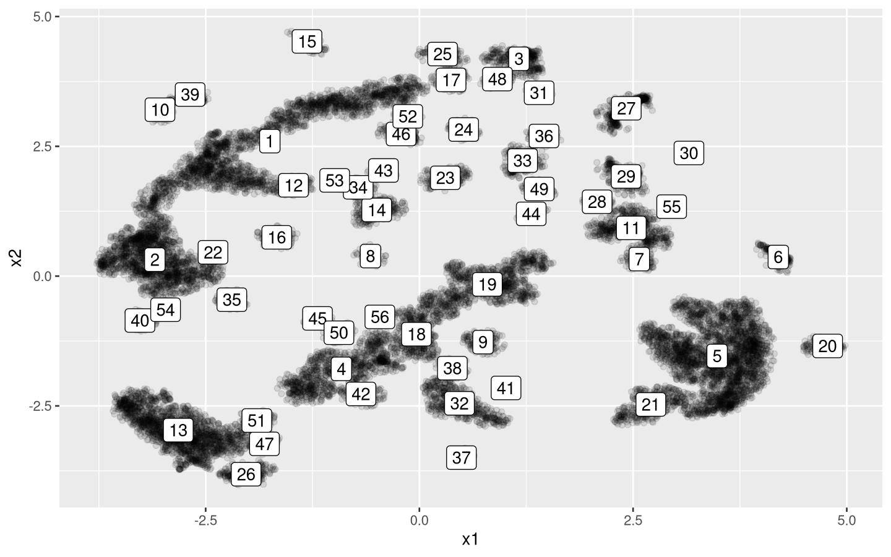
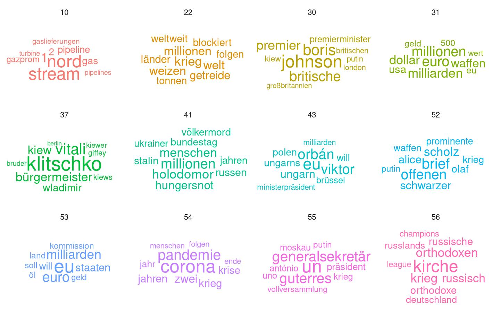
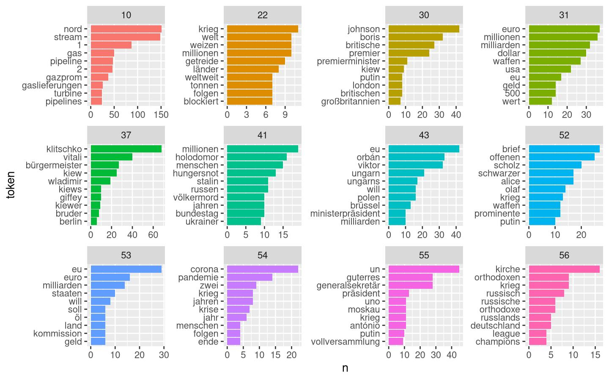
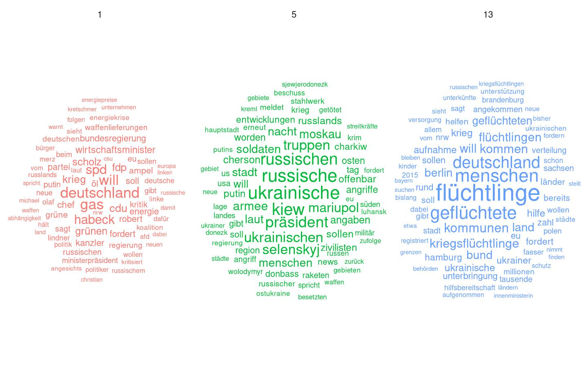

Topic modelling with German language data
================
Lennart Kasserra
2023-03-29

This is an example of how to use the data sets for a slightly more
interesting analysis. We will use all articles on the Russian invasion
of Ukraine to do some topic modelling to try to identify some of the
separate topics media reporting revolved around.

We will use doc2vec (paragraph2vec) to generate document embeddings,
then use UMAP for dimensionality reduction, and finally DBSCAN for
clustering. This is essentially a manual implementation of top2vec
(Angelov 2020), but we find that doing these steps separately enables
more fine grained control over each stage.

# Packages

``` r
library(uwot)
library(dplyr)
library(purrr)
library(dbscan)
library(plotly)
library(doc2vec)
library(ggplot2)
library(stringr)
library(tidytext)
library(htmlwidgets)
```

# Pre-Processing

First, we need to read the data. From my experience, it is convenient to
keep the related dataframes together in a list:

``` r
files <- c("spiegel.csv", "welt.csv", "taz.csv", "sz.csv", "zeit.csv")
full_list <- map(files, readr::read_csv)
names(full_list) <- str_remove(files, "\\.csv")
```

Next, we do some initial cleaning (removing ticker articles & selecting
only the columns that we need):

``` r
# Drop ticker articles from Zeit:
full_list$zeit <-
  full_list$zeit |>
  filter(!grepl("^Hier finden Sie", description))

full_list <- map2(
  full_list,
  names(full_list),
  function(df, name) {
    df |>
      select(keywords, date, description) |>
      mutate(
        site = name,
        date = str_remove(date, pattern = "(\\s|T)(.*?)$")
      )
  }
)

# putting everything into one data frame:
main <- tibble(do.call(rbind, full_list))
```

Next we will:

1.  select only articles on Ukraine
2.  remove non-German articles
3.  tokenizing
4.  stemming

``` r
# removing live ticker articles from other pages:
patterns <- c(
  "^Integrationskurse dauern in der Regel einige Monate",
  "^Seit dem 24. Februar 2022 hält uns der preisgekrönte",
  "^Seit dem ersten Kriegsmorgen hält uns der preisgekrönte"
)

main <-
  main |>
  mutate(
    date = lubridate::ymd(date),
    id = paste0(site, "-", as.character(row_number()))
  ) |>
  # Only Ukraine:
  filter(grepl("[Uu]krain", keywords)) |> 
  filter(
    # Only since beginning of invasion:
    date >= "2022-02-24",
    # no Russian/Ukrainian:
    !grepl("[\\p{Cyrillic}]", description, perl = TRUE),
    !grepl(paste0(patterns, collapse = "|"), description) 
  ) |>
  select(-keywords)

# stemming:
stopwords <- data.frame(word = lsa::stopwords_de)
majority_false <- function(vec) length(vec[vec]) < length(vec[!vec])

tokenized <-
  main |>
  select(id, description) |>
  unnest_tokens(output = "word", input = "description") |>
  anti_join(stopwords) |>
  # drop english descriptions (i.e. containing mostly english words):
  mutate(is_english = word %in% qdapDictionaries::GradyAugmented) |>
  group_by(id) |>
  filter(majority_false(is_english)) |>
  ungroup() |>
  select(-is_english)

stemmed <-
  tokenized |>
  mutate(token_stem = unine::german_stemmer(word)) |> 
  select(-word) |>
  aggregate(token_stem ~ id, data = _, paste, collapse = " ")
```

# Modelling

## doc2vec

First, we need to prepare our token data set for doc2vec (the
implementation in the `doc2vec`-package (Wijffels 2021) expects a
specific structure):

``` r
stemmed <-
  stemmed |>
  select(id, token_stem) |>
  rename("doc_id" = id, "text" = token_stem) |>
  tibble()
```

Now we can run doc2vec. Choosing model parameters for self-trained word-
or document-embedding models seems to be based more on trial-and-error
and loose convention, than ironclad logic and rules. While some hold
that “typically, something like 300 dimensions are used” (Schwab 2018),
others give more exact directions, like using the fourth root of the
total number of unique categorical elements, or alternatively
approximately 1.6 times the square root of the number of unique elements
in the category, but no less than 600 (Lakshaman, Robinson & Munn 2020).
However, we consider “no less than 600” an excessive amount of
dimensions considering Google used only 300 dimensions for its word2vec
model for Google News, which draws on the Google News dataset with
around 100 billion words and has a vocabulary of around 3 million unique
words, magnitudes larger than our own corpus.

The window size defaults to 10 for PV-DBOW; Lee & Mikolov (2014)
recommend a window size between 5 & 12, so this seemed reasonable.

In terms of iterations, we tested different numbers of iterations (10,
20, 200, 300, 500, 1000), but they did not seem to make a large
difference for the final outcome.

We chose distributed bag-of-words paragraph vectors (PV-DBOW) over
distributed memory (PV-DM), since in our testing PV-DM did not seem to
perform as well in identifying apparent contentual similarity. Thus, our
final model looks like this:

``` r
model <-
    stemmed |>
    paragraph2vec(type = "PV-DBOW", dim = 300, iter = 10, threads = 4)

embedding <- as.matrix(model)
```

## Dimensionality reduction

Next, we use UMAP for dimensionality reduction (`uwot::umap()` defaults
to targetting two dimensions, so no need to specify this explicitly):

``` r
reduced <-
  embeddings |>
  umap(n_neighbors = 15, n_threads = 4) |>
  as.data.frame() |>
  tibble::rownames_to_column()

names(reduced) <- c("id", "x1", "x2")
```

Let’s take a look:

``` r
plot1 <- 
  reduced |>
  ggplot(aes(x = x1, y = x2)) +
  geom_point(alpha = 0.1) 

plot1
```

<!-- -->

Certainly not a beauty, but using density-based clustering will help us
to identify some topics.

## DBSCAN

For choosing an initial $\epsilon$, we can consider an elbow plot:

``` r
points <- reduced |> select(x1, x2)

kdist <- data.frame(
  x = 1:nrow(points),
  y = sort(kNNdist(points, 4), decreasing = TRUE)
)

kdist |>
  ggplot(aes(x, y)) +
  geom_point() +
  geom_line()
```

<!-- -->

Choosing fitting parameters, again, requires a bit of trial-and-error;
after playing around for a bit, 0.132 seemed a good choice. For minimum
points, we go with 50 in this case; this may seem many, but otherwise we
will have plenty of meaningless small clusters with relatively low
density.

``` r
clustered <-
  points |>
  dbscan(eps = 0.132, minPts = 50)
```

We can now add the cluster IDs back to the points:

``` r
with_cluster <-
  reduced |>
  cbind(clustered$cluster) |>
  rename("cluster" = `clustered$cluster`) |>
  mutate(noise = ifelse(cluster > 0, 0L, 1L)) # cluster 0 = noise!
```

Taking a look at what DBSCAN considers noise vs. what is part of a
cluster:

``` r
plot2 <- 
  with_cluster |> 
  ggplot(aes(x = x1, y = x2, color = factor(noise))) +
  geom_point(alpha = 0.1) +
  theme(legend.position = "none") +
  labs(caption = "blue = noise")

cowplot::plot_grid(plot1, plot2)
```

<!-- -->

A good rule of thumb is that less than a third of the data points should
be considered noise:

``` r
with_cluster |> 
  count(noise) |> 
  mutate(total = sum(n), perc = n / total) |> 
  select(noise, n, perc)
#> # A tibble: 2 × 3
#>   noise     n  perc
#>   <int> <int> <dbl>
#> 1     0 18703 0.674
#> 2     1  9045 0.326
```

Let’s drop noise and look at some clusters. These are the ones DBSCAN
has identified:

``` r
centroids <-
  with_cluster |>
  filter(cluster > 0) |>
  group_by(cluster) |>
  summarize(x1 = mean(x1), x2 = mean(x2))

ggplot() +
  geom_point(
    data = with_cluster[with_cluster$cluster > 0, ],
    aes(x = x1, y = x2),
    alpha = 0.1
  ) +
  geom_label(
    data = centroids,
    aes(x = x1, y = x2, label = as.character(cluster))
  )
```

<!-- -->

# Exploring clusters

Let’s explore some of the clusters. We can identify some candidates by
considering the more “dense” clusters; we can for example consider the
clusters that have the lowest mean euclidean distance to their center,
so those that are very tightly packed:

``` r
by_density <-
  with_cluster |>
  filter(cluster > 0) |> 
  select(id, cluster, x1, x2) |>
  group_by(cluster) |>
  summarise(
    centroid_x1 = mean(x1),
    centroid_x2 = mean(x2)
  ) |>
  right_join(with_cluster, by = "cluster") |>
  filter(cluster > 0) |> 
  mutate(
    dist_x1 = sqrt((x1 - centroid_x1) ^ 2),
    dist_x2 = sqrt((x2 - centroid_x2) ^ 2),
    total_dist = dist_x1 + dist_x2
  ) |>
  group_by(cluster) |>
  summarise(mean_dist_centroid = mean(total_dist)) |>
  arrange(mean_dist_centroid)
```

Let’s look at the top 12, since 3x4 fits neatly into grids for
visualizing:

``` r
top_clusters <-
  by_density |>
  head(12) |>
  pull(cluster)

top_clusters
#>  [1] 30 37 41 10 56 53 43 22 52 31 54 55
```

We can now compute the most frequent words by cluster to identify the
topic they revolve around:

``` r
stopwords <- data.frame(token = lsa::stopwords_de)
to_exclude <- c(
  "er", "ukraine", "russland", "man", "nun", "doch", "jetzt", "überblick"
)

freq <-
  stemmed |>
  select(id, description, token_stem) |>
  left_join(with_cluster, by = "id") |>
  filter(cluster %in% top_clusters) |>
  tibble() |>
  select(cluster, description) |>
  unnest_tokens(output = "token", input = "description") |>
  anti_join(stopwords) |>
  filter(!token %in% to_exclude) |> 
  group_by(cluster) |>
  count(token) |>
  arrange(cluster, desc(n)) |>
  slice(1:10) |>
  tibble()
```

Let’s cast this into a wordcloud (note that we use relative frequencies
of the words):

``` r
freq |>
  group_by(cluster) |>
  summarize(total = sum(n)) |>
  right_join(freq, by = "cluster") |>
  ggplot(aes(label = token, size = n / total, color = factor(cluster))) +
  ggwordcloud::geom_text_wordcloud() +
  theme_minimal() +
  scale_size_area(max_size = 8) +
  facet_wrap(~ cluster)
```

<!-- -->

It seems our model did quite well at actually identifying distinct
topics! If you hate wordclouds as much as I do, here is a less playful
visualization:

``` r
freq |>
  mutate(
    cluster = as.factor(cluster),
    token = tidytext::reorder_within(token, n, cluster)
  ) |>
  ggplot(aes(token, n, fill = cluster)) +
  geom_col(show.legend = FALSE) +
  facet_wrap(~cluster, scales = "free") +
  coord_flip() +
  scale_x_reordered()
```

<!-- -->

Let’s look at the biggest clusters:

``` r
biggest_clusters <- 
  with_cluster |> 
  filter(cluster != 0) |> 
  count(cluster) |> 
  arrange(desc(n)) |> 
  head(3) |> 
  pull(cluster)

stemmed |> 
  left_join(with_cluster, by = "id") |> 
  select(id, cluster, description) |> 
  filter(cluster %in% biggest_clusters) |> 
  unnest_tokens(output = "token", input = "description") |> 
  anti_join(stopwords) |> 
  filter(!token %in% to_exclude) |> 
  group_by(cluster) |> 
  count(token) |> 
  group_by(cluster) |> 
  mutate(total = sum(n), freq = n / total) |> 
  arrange(cluster, desc(n)) |> 
  slice(1:75) |> 
  ggplot(aes(label = token, size = freq, color = factor(cluster))) +
  ggwordcloud::geom_text_wordcloud() +
  theme_minimal() +
  scale_size_area(max_size = 8) +
  facet_wrap(~ cluster)
```

<!-- -->

It seems the three biggest clusters revolve around German domestic
politics regarding the war and its impact (1), what seems like war
reporting (5), and refugees (13).

# Literature

Angelov, D. (2020). Top2Vec: Distributed Representations of Topics.
*ArXiv pre-print*, available at: <https://arxiv.org/abs/2008.09470>.

Lakshaman, V., Robinson, S. & Munn, M. (2020). *Machine Learning Design
Patterns: Solutions to Common Challenges in Data Preparation, Model
Building & MLOps*. O’Reilly Media: Sebastopol, CA.

Le, Q. & Mikolov, T. (2014). Distributed Representations of Sentences
and Documents. *Proceedings of the 31st International Conference on
Machine Learning*, 32. pp. 1188-1195.

Schwab, A. (2018). Embeddings: A Matrix of Meaning. *Medium*, available
at:
<https://petuum.medium.com/embeddings-a-matrix-of-meaning-4de877c9aa27>.

Wijffels, J. (2018). doc2vec: Distributed Representations of Sentences,
Documents and Topics. *R package*, version 0.2.0. available at:
<https://CRAN.R-project.org/package=doc2vec>.
